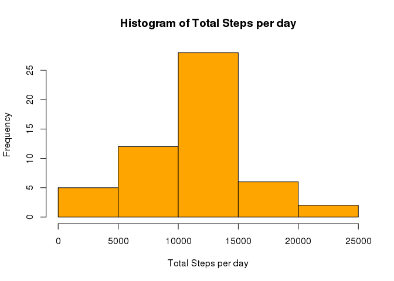
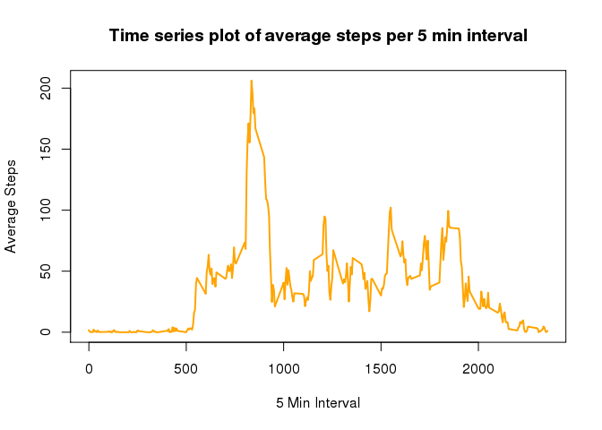
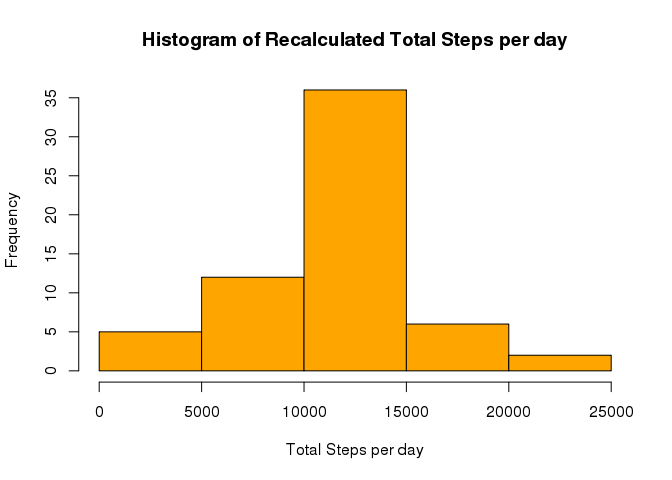
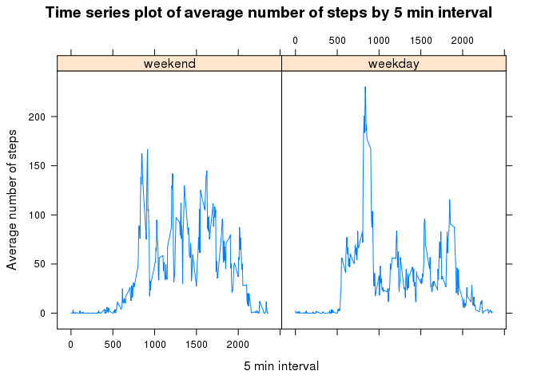

# Human Activity Data Analysis
Swarna Kamal Paul  
6/1/2017  

This analysis makes use of data from a personal activity monitoring device. This device collects data at 5 minute intervals through out the day. The data consists of two months of data from an anonymous individual collected during the months of October and November, 2012 and include the number of steps taken in 5 minute intervals each day.

Data has been download from the url https://d396qusza40orc.cloudfront.net/repdata%2Fdata%2Factivity.zip

The variables included in this dataset are:

steps: Number of steps taking in a 5-minute interval (missing values are coded as NA)

date: The date on which the measurement was taken in YYYY-MM-DD format

interval: Identifier for the 5-minute interval in which measurement was taken

The dataset is stored in a comma-separated-value (CSV) file and there are a total of 17,568 observations in this dataset.


### Reading Data
The dataset can be read by the below code:


```r
data<-read.csv("activity.csv", stringsAsFactors=FALSE)
data$date <- as.Date(data$date)
```


### Histogram, mean and median of total number of steps taken per day

The following code calculates the total number fo steps taken per day after ignoring NA values. It draws the histogram and calculates mean and median.


```r
data_without_NA <-data[complete.cases(data),]
total_steps_per_day<-aggregate(steps~date,data_without_NA,sum)
hist(total_steps_per_day$steps, xlab ="Total Steps per day", col="orange",main="Histogram of Total Steps per day")
```

<!-- -->

```r
paste("Mean total steps per day is",mean(total_steps_per_day$steps))
```

```
## [1] "Mean total steps per day is 10766.1886792453"
```

```r
paste("Median total steps per day is",median(total_steps_per_day$steps))
```

```
## [1] "Median total steps per day is 10765"
```


###Time series plot and maximum average steps taken in 5 minute interval across all days

The following code plots the time series of 5 minute interval and average number of steps taken across all days. It also calculates which 5-minute interval, on average across all the days in the dataset, contains the maximum number of steps


```r
avg_steps_per_interval<-aggregate(steps~interval,data_without_NA,mean)
plot(steps~interval,data=avg_steps_per_interval, xlab ="5 Min Interval",ylab="Average Steps", col="orange",lwd=2,type="l",main="Time series plot of average steps per 5 min interval")
```

<!-- -->

```r
paste("Interval having maximum number of average steps is ",avg_steps_per_interval[which.max(avg_steps_per_interval$steps),]$interval)
```

```
## [1] "Interval having maximum number of average steps is  835"
```


###Imputing missing values, plotting histogram and recalculating mean median

The following code calculates number of missing values in the steps attribute, fills in the missing value by the average steps in that 5 min interval, draws histogram of the total number of the steps per day, calculates mean and median and reports the difference in measures from that of the previous estimates.


```r
paste("Total number of missing values are ",sum(is.na(data$steps)))
```

```
## [1] "Total number of missing values are  2304"
```

```r
#### Code to fill in missing values
Filled_in_data<-data
for (i in 1:nrow(Filled_in_data))
  {
  if (is.na(Filled_in_data[i,]$steps))
  {
    Filled_in_data[i,]$steps <- round(avg_steps_per_interval[avg_steps_per_interval$interval==Filled_in_data[i,]$interval,]$steps)
  }
}

recalculated_total_steps_per_day<-aggregate(steps~date,Filled_in_data,sum)
hist(recalculated_total_steps_per_day$steps, xlab ="Total Steps per day", col="orange",main="Histogram of Recalculated Total Steps per day")
```

<!-- -->

```r
paste("Recalculated mean total steps per day is",mean(recalculated_total_steps_per_day$steps))
```

```
## [1] "Recalculated mean total steps per day is 10765.6393442623"
```

```r
paste("Recalculated median total steps per day is",median(recalculated_total_steps_per_day$steps))
```

```
## [1] "Recalculated median total steps per day is 10762"
```

**The mean and median have reduced from the previous estimates**


###Panel plot comparing the average number of steps taken per 5-minute interval across weekdays and weekends

The following code creates a factor variable weekday_indicator based on whether a date is weekday or weekend and makes a time series panel plot of average number of steps by 5 min interval across all weekdays or weekend days


```r
weekend_list <- c('Saturday', 'Sunday')
Filled_in_data$weekday_indicator<-factor(weekdays(Filled_in_data$date) %in% weekend_list,labels=c("weekend","weekday"),levels=c(TRUE, FALSE))

avg_steps_per_interval_weekday <- aggregate(steps~interval+weekday_indicator,Filled_in_data,mean)

library(lattice)
xyplot(steps ~ interval | weekday_indicator, data = avg_steps_per_interval_weekday,type = "l",xlab="5 min interval",ylab="Average number of steps",main="Time series plot of average number of steps by 5 min interval")
```

<!-- -->
